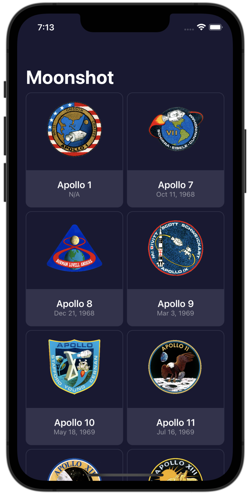
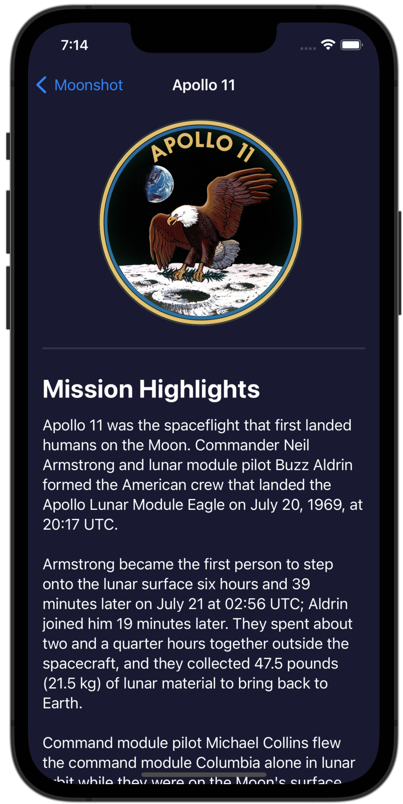
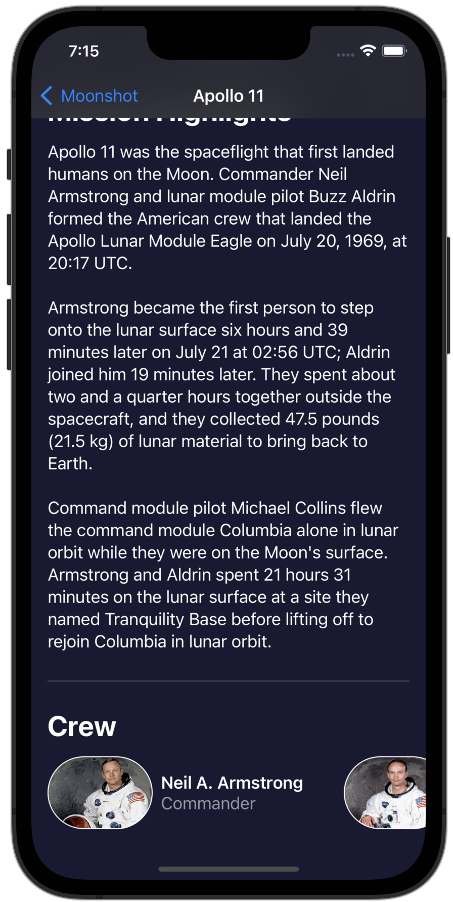
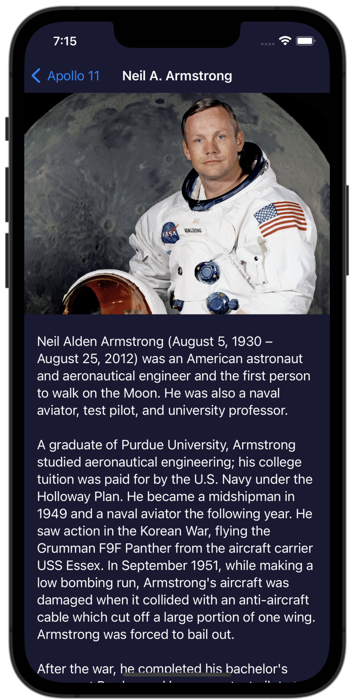

# Moonshot
App that lets users learn about the missions and astronauts that formed NASA's Apollo space program.

 

 

Based on 100 Days with SwiftUI by Paul Hudson
Information about Apollo space program taken from Wikipedia.
